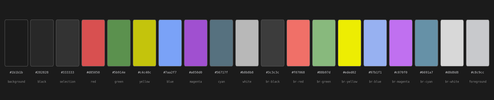
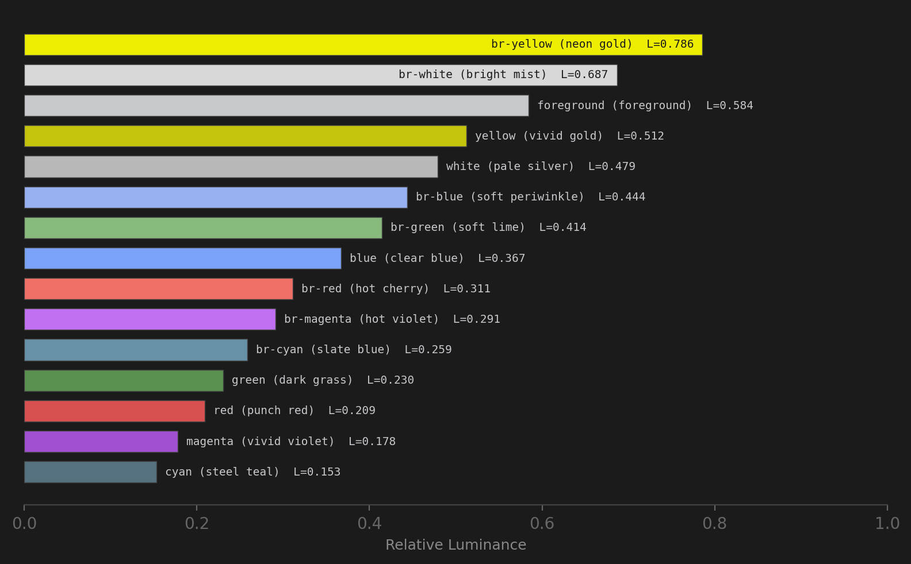
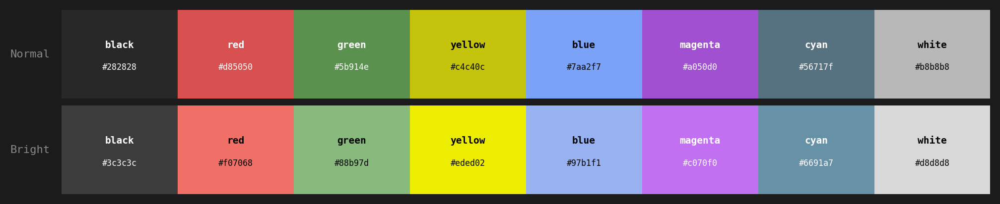
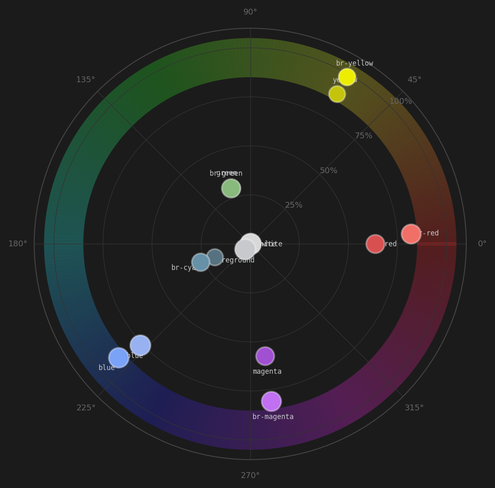
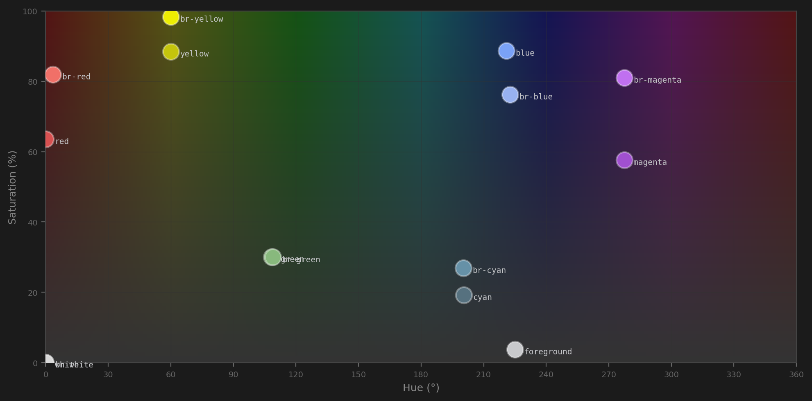
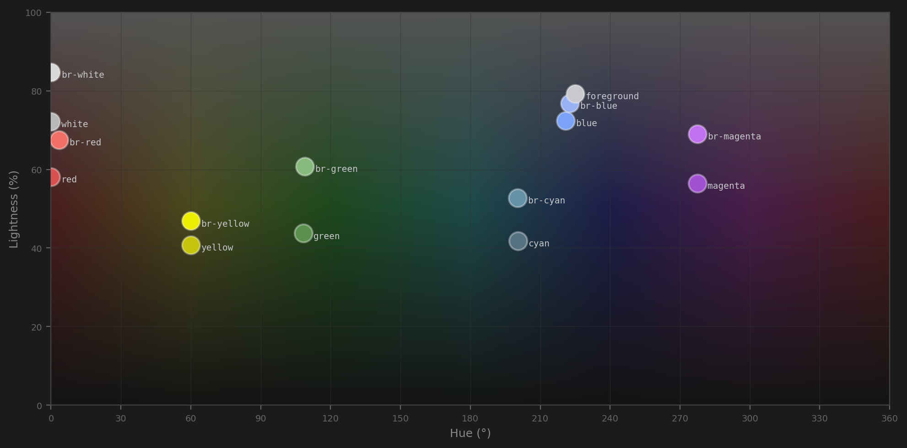
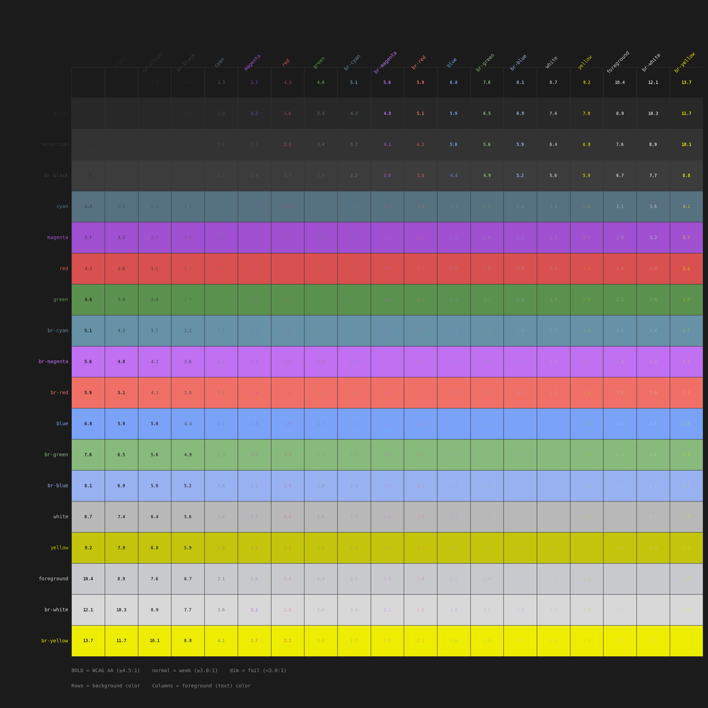

# Dalton Dark — A Colorblind-Friendly Terminal Theme

A dark terminal color scheme designed for **deuteranopia and protanopia** (red-green color blindness), tuned by a developer who actually has it.

Named after [John Dalton](https://en.wikipedia.org/wiki/John_Dalton), who in 1794 gave the first scientific description of color blindness — a condition he experienced himself. The medical term [daltonism](https://en.wikipedia.org/wiki/Color_blindness#History) is still used today.

Red-green color vision deficiency affects ~8% of men and ~0.5% of women worldwide ([Nature Methods, 2011](https://www.nature.com/articles/nmeth.1618)). Standard terminal palettes ignore this entirely — `git diff` uses red/green, test frameworks show green pass / red fail, and TUI apps like lazygit rely on ANSI colors that are indistinguishable for deuteranopes.

## What's included

- **WezTerm** color palette (TOML + Lua snippet)
- **Lazygit** theme config (YAML)
- **Contrast matrix** (HTML) — WCAG contrast validation
- **Color spectrum** (HTML) — hue×saturation, hue×lightness maps with gradient backgrounds
- **CSS custom properties** — single source of truth for all colors

## Design principles

- **No red-green reliance.** Every color pair is distinguishable under deuteranopia simulation.
- **Blue-yellow axis primary.** Uses the intact color axis for maximum differentiation.
- **Even luminance spread.** Each color has a distinct luminance value — no two foreground colors cluster.
- **WCAG AA for bright variants.** All bright colors and most normals exceed 4.5:1 on background. Three normal colors (cyan 3.3:1, magenta 3.7:1, red 4.3:1) trade strict AA compliance for hue accuracy — their bright variants cover AA.
- **Matched pair.** WezTerm ANSI palette and lazygit hex theme designed and validated together.
- **Comfort zone targeting.** Colors aim for 5:1–10:1 contrast — readable without being harsh.

## Palette

| ANSI Name | Color | Hex | Name | Bright | Hex | Name |
|-----------|-------|-----|------|--------|-----|------|
| Black |  | `#282828` | black |  | `#3c3c3c` | ash |
| Red |  | `#d85050` | punch red |  | `#f07068` | hot cherry |
| Green |  | `#5b914e` | dark grass |  | `#88b97d` | soft lime |
| Yellow |  | `#c4c40c` | vivid gold |  | `#eded02` | neon gold |
| Blue |  | `#7aa2f7` | clear blue |  | `#97b1f1` | soft periwinkle |
| Magenta |  | `#a050d0` | vivid violet |  | `#c070f0` | hot violet |
| Cyan |  | `#56717f` | steel teal |  | `#6691a7` | slate blue |
| White |  | `#b8b8b8` | pale silver |  | `#d8d8d8` | bright mist |

**Base colors:**

| Element         | Hex       |
|-----------------|-----------|
| Foreground      | `#c8c9cc` |
| Background      | `#1b1b1b` |
| Cursor          | `#9a9a9a` |
| Selection BG    | `#333333` |
| Selection FG    | `#dcdcdc` |

## Installation

### WezTerm

Add to your `wezterm.lua`:

```lua
config.colors = {
  foreground = "#c8c9cc",
  background = "#1b1b1b",
  cursor_bg = "#9a9a9a",
  cursor_fg = "#1b1b1b",
  selection_bg = "#333333",
  selection_fg = "#dcdcdc",

  ansi = {
    "#282828", -- black
    "#d85050", -- red        punch red
    "#5b914e", -- green      dark grass (30% sat)
    "#c4c40c", -- yellow     vivid gold (88% sat)
    "#7aa2f7", -- blue       clear blue
    "#a050d0", -- magenta    vivid violet
    "#56717f", -- cyan       steel teal (H=200°)
    "#b8b8b8", -- white      pale silver
  },
  brights = {
    "#3c3c3c", -- br black   ash
    "#f07068", -- br red     hot cherry
    "#88b97d", -- br green   soft lime (30% sat)
    "#eded02", -- br yellow  neon gold (98% sat)
    "#97b1f1", -- br blue    soft periwinkle
    "#c070f0", -- br magenta hot violet
    "#6691a7", -- br cyan    slate blue (H=200°)
    "#d8d8d8", -- br white   bright mist
  },
}
```

### Lazygit

Add to `~/.config/lazygit/config.yml` (or `~/Library/Application Support/lazygit/config.yml` on macOS):

```yaml
gui:
  theme:
    activeBorderColor:
      - "#7aa2f7"
      - bold
    inactiveBorderColor:
      - "#3c3c3c"
    searchingActiveBorderColor:
      - "#eded02"
      - bold
    optionsTextColor:
      - "#97b1f1"
    selectedLineBgColor:
      - "#333333"
    inactiveViewSelectedLineBgColor:
      - "#282828"
    cherryPickedCommitBgColor:
      - "#333333"
    cherryPickedCommitFgColor:
      - "#eded02"
    markedBaseCommitBgColor:
      - "#333333"
    markedBaseCommitFgColor:
      - "#f07068"
    unstagedChangesColor:
      - "#d85050"
    defaultFgColor:
      - "#c8c9cc"
```

### Nix / Home Manager

```nix
programs.lazygit = {
  enable = true;
  settings.gui.theme = {
    activeBorderColor = [ "#7aa2f7" "bold" ];
    inactiveBorderColor = [ "#3c3c3c" ];
    searchingActiveBorderColor = [ "#eded02" "bold" ];
    optionsTextColor = [ "#97b1f1" ];
    selectedLineBgColor = [ "#333333" ];
    inactiveViewSelectedLineBgColor = [ "#282828" ];
    cherryPickedCommitBgColor = [ "#333333" ];
    cherryPickedCommitFgColor = [ "#eded02" ];
    markedBaseCommitBgColor = [ "#333333" ];
    markedBaseCommitFgColor = [ "#f07068" ];
    unstagedChangesColor = [ "#d85050" ];
    defaultFgColor = [ "#c8c9cc" ];
  };
};
```

## Visualizations

### Swatches



### Luminance spread



### ANSI strips



### Color wheel



### Hue × Saturation



### Hue × Lightness



### WCAG contrast matrix



## Validation tools

- **`contrast-matrix.html`** — interactive WCAG contrast matrix with luminance spread chart
- **`color-spectrum.html`** — color wheel, hue×saturation map, hue×lightness map (with full HSL gradient backgrounds), and ANSI strips
- **`dalton-dark.css`** — CSS custom properties define all colors; edit once, both visualizations update

## Note on lazygit hex colors

Lazygit versions <=0.59 may not apply hex colors from the config file in some setups. If you experience this, use `lazygit -ucf path/to/config.yml` to verify hex colors work in your build. Named ANSI colors always work as a fallback — the WezTerm palette maps them to the same accessible values.

## See also

- [COMPARISON.md](./COMPARISON.md) — scientific comparison to Okabe-Ito, Modus Vivendi, EF Deuteranopia, and Solarized

## License

MIT
